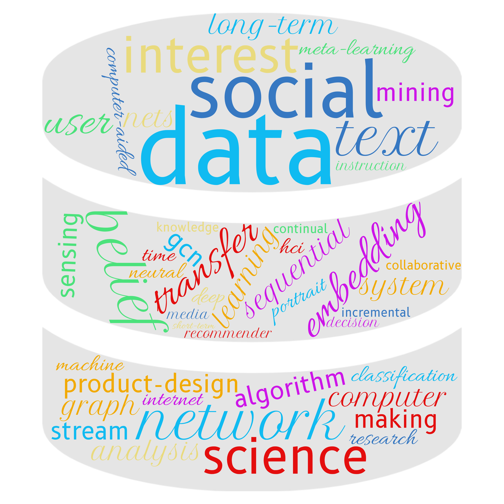

Bio
======
My name is Jingyuan Huang, an undergraduate student majored in Computer Engineering at Zhejiang University and University of Illinois, Urbana-Champaign, pursuing double degrees from ZJU and UIUC. During these years, I'm very fortunate to be advised by Prof. [Tarek Abdelzaher](http://abdelzaher.cs.illinois.edu/) at UIUC and Prof. [Hongwei Wang](https://person.zju.edu.cn/en/hwang) at ZJU.

Research Interest
======
My research interest mainly focuses on data mining, social recommendation, transfer learning and decision making.

Publication
======
(* indicates equal contributions)
1.	Jialin Shang\*, **Jingyuan Huang**\*, Shihua Zeng\*, Jian Zhang, and Hongwei Wang (2022). [Representation and Extraction of Physics Knowledge Based on Knowledge Graph and Embedding-Combined Text Classification for Cooperative Learning.](https://ieeexplore.ieee.org/abstract/document/9776230/) 2022 IEEE 25th International Conference on Computer Supported Cooperative Work in Design (CSCWD).
   
Dataset
======
### ZJUI-Phys Dataset

An interdisciplinary dataset related to a combination of education and AI. The collaborative signals are of great research value.
[ZJUI-Phys Dataset](https://github.com/Luckfort/ZJUI-Phys)
